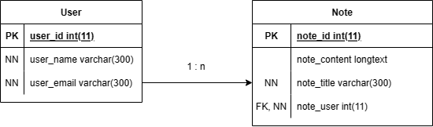

# Notes API (m151-phpapi)
Eine PHP REST API mit MariaDB Datenbankanbindung für eine Benutzerverwaltung und die Funkitonalitäten für Verwaltung von Usern und deren Notizen. Für den User, als auch für die Notizen gibt es die Möglichkeit zur Erstellung, Ausgabe und Löschung. In dieser Umsetzung wurde weder ein Sessionhandling noch ein Authorisierung umgesetzt, es sind also alle Endpunkte für jeden verfügbar. Folgende Endpunkte werden angeboten:

| Endpunkt           | Beschreibung                 | Methode | Parameter    |
| ------------------ | ---------------------------- | ------- | ------------ |
| user/{userid}      | Get specific User            | GET     | userid (INT) |
| user/{userid}      | Delete a specific User       | DELETE  | userid (INT) |
| user/              | Create a new User            | POST    | User Object  |
| user/note          | Create new Note for User     | POST    | Note Object  |
| user/note/{noteid} | Gets a specific User Note    | GET     | notid (INT)  |
| user/note/{noteid} | Deletes a specific User Note | DELETE  | notid (INT)  |

**JSON Entitäten**
User Object
```json
{
  "user_email": "test@test.ch",
  "user_name": "Test"
}
```
Note Object
```json
{
  "note_title": "test",
  "note_content": "lorem ipsum",
  "note_user": 1
}
```

***

## Installation
Diese API ist eine Standalone Applikation. Es müssen also keine zusätzlichen Dependencys installiert werden. Für das lokale Hosting kann ein Apache V-Host erstellt werden. Hierfür müssen 2 Config Files angepasst werden:

**1. V-Hosts Conifg: ...\apache\conf\extra\httpd-vhosts.confg**
```xml
<VirtualHost *:80>
    ServerAdmin example@example.com
    DocumentRoot "Path/to/the/api"
    ServerName examplehostname
    <Directory Path/to/the/api>
     	Order allow, deny
        Allow from all
        Require all granted
    </Directory>
</VirtualHost>
```

**2. Hosts File: C:\Windows\System32\drivers\etc\hosts**
```xml
	127.0.0.1		phpapi
```

#### ORM Mapper Installation
Das Dependency Management wurde mit composer gelöst. Es muss also zuerst composer installiert sein, danach kann man mit folgendem Befehl alle Dependencys installieren:
```
composer install
```
Alle Librarys werden im Folder chapter2/vendor generiert.

***

## Architektur
Hier wurde eine MVC Architektur umgesetzt. Da es sich aber um eine REST API Schnittstelle handelt, werden keine Views benötigt. Es ist also eine Model-Controller Architektur.

<br>
<font size="2">*Quelle: [GeeksForGeeks - MVC](https://media.geeksforgeeks.org/wp-content/uploads/20210629165722/mvc.png)*</font>

Der View Teil ist in dieser API mit JSON implementiert. Die Responses, wie auch die Requests werden in JSON oder auch Path Parameter übergeben.

**Umsetzung im Code**
Im Code wurden die Controller so implementiert, dass sie Methoden für die HTTP Request Methoden besitzen. Ein Controller hat also zum Beispiel eine Methode GET. Wenn man den Controller mittels POST aufruft und die Methode nicht existiert wird mit der Magic Method der Überklasse Basecontroller (__call) ein 405 - Method not allowed zurückgegeben. Der Controller verwendet wiederum die Models, welche die von der Database Klasse erben. Diese führen die SQL Statements aus.

***
## Datenbankschema



In der Datenbank existieren 2 Tabellen. Eine Tabelle für die User und eine für die Notizen. Die Tabellen haben eine abhängigkeit zueinander, da eine Notiz immer eine Zugehörigkeit zu einem User hat. Da eine Notiz genau einem User gehört, ein User aber mehrere Notizen haben kann ist dies eine <b>1:n</b> Beziehung.

***

## Testing
Für das Testing sind im Ordner test/ verschiedene REST Files abgelegt. Diese beeinhalten mehrere vorgefertigte REST Requests, welche ausgeführt werden könne. Sie zeigen Beispiele für alle Endpunkte und Funktionen der API.

Die Beispiel Requests wurden als Sequenz geordnet. Die Requests sollen also einer nach dem anderen von oben nach unten ausgeführt werden. Das Muster dabei ist immer zuerst POST um einen neuen Datensatz einzufügen, dann GET um zu überprüfen ob dies korrekt funktioniert hat. Anschliessend ein DELETE um den erstellten Datensatz wieder zu entfernen, gefolgt von einem weiteren GET um auch das Löschen zu überprüfen.

***

## ORM
Als ORM Mapper wurde im chapter2/ Doctrine eingesetzt. Für das Dependency Management ist composer verwendet werden. Für ORM wurden die 2 Models zu Doctrine Entitäten umgewandelt. Im bootstrap.php File findet die ganze Initalisierung und Konfigurierung statt.

Um Enitäten, etc. zu generieren und damit zu arbeiten, bietet Doctrine ein Command Line Interface an. Dies ist im chapter2/bin/doctrine konfiguriert.

Doctrine: [Doctrine - Get Started](https://www.doctrine-project.org/projects/doctrine-orm/en/current/tutorials/getting-started.html)

***

## Reflexion
Insgesamt fand ich dies ein spannendes und interessantes Projekt, da man sich auch etwas mit der ganzen Umgebung der Datenbank und Konfigurationen auseinandersetzen muss. Trotzdem finde ich das Umsetzen von APIs in PHP sehr umständlich, da für einiges keine oder nur sehr spezielle Lösungen bietet.

Mit dem Endresultat bin ich trotzdem sehr zufrieden, und habe auch einiges neues gelernt. Zum Beispiel kannte ich composer noch gar nicht, ich wusste nicht einmal das es Dependency Managements für PHP gibt. Auch die ORM Umsetzung in PHP habe ich bisher noch nie verwendet. Deshalb finde ich es insgesamt ein gelungenes und lehrreiches Projekt.